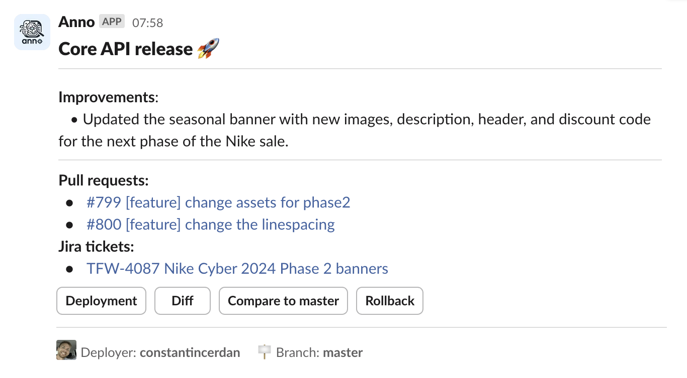
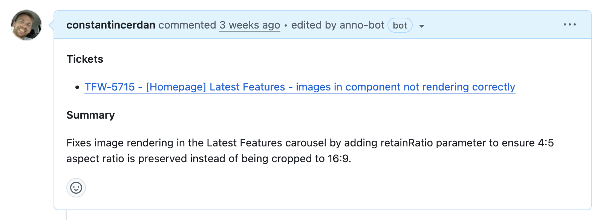

# Anno
Anno is a **GitHub Action** that leverages LLMs to do two things:

1. [Release Summaries](#release-summaries)
2. [Pull Request Summaries](#pull-request-summaries)


## Release Summaries
The `release-summary` mode summarises code changes released between workflow runs and posts them to Slack.



It can also integrate with **Jira** to include titles and links for any issue numbers found in associated pull requests, branch names, or commit messages.

### **Usage**

The minimum required inputs are:
-  `mode`
-  `chat_gpt_api_key`
-  `slack_webhook_url`
-  `github_token`

The latter is automatically available as a secret.

```yaml
uses: constantincerdan/anno@v5
with:
  # Action mode - 'release-summary' for release summaries
  # Required.
  mode: release-summary

  # App name for the Slack message.
  # Default: Repository name.
  app_name: ""

  # ChatGPT API key for chat completions.
  # Required for 'release-summary' mode.
  chat_gpt_api_key: ""

  # ChatGPT model to use.
  # Default: `gpt-4o`.
  chat_gpt_model: ""

  # GitHub token to access the repository. This is automatically available as a secret.
  # Required.
  github_token: ${{ secrets.GITHUB_TOKEN }}

  # Jira username and API key (base64 encoded `<username>:<api_token>`).
  # Required for Jira integration.
  jira_api_key: ""

  # Jira instance base URL (e.g., https://my-company.atlassian.net).
  # Required if `jira_api_key` is provided.
  jira_base_url: ""

  # Slack webhook URL for the release summary.
  # Required for 'release-summary' mode.
  slack_webhook_url: ""

  # Newline-separated list of glob patterns for file paths to include or exclude in release summary analysis.
  # Default: All paths.
  paths: ""
```

**Note:** Ensure Anno requires the previous job(s) to complete first so that it runs only after your deployment is successful:

```yaml
jobs:
  prod-deploy:
    # ...deployment steps

  anno:
    uses: constantincerdan/anno@v5
    needs:
      - prod-deploy
```

### Monorepo Usage

There should be no special setup required for monorepos. Anno uses your workflow's [`on.push.paths`](https://docs.github.com/en/actions/writing-workflows/workflow-syntax-for-github-actions#example-including-paths) and [`on.push.paths-ignore`](https://docs.github.com/en/actions/writing-workflows/workflow-syntax-for-github-actions#example-excluding-paths) properties to determine which files and commits to include in its analysis:

```yaml
on:
  push:
    paths:
      - 'sub-project/**'
      - '!sub-project/docs/**'
```

However, for more precise control (or to override the workflow config), use the `paths` input as shown below.

### File Filtering with `paths`

You can control which files Anno analyses using the `paths` input. This is useful for any repository but especially helpful in monorepos:

```yaml
uses: constantincerdan/anno@v5
with:
  paths: |-
    sub-project/**
    !sub-project/docs/**
```

This accepts newline or comma-separated glob patterns and takes precedence over any [`on.push.paths`](https://docs.github.com/en/actions/writing-workflows/workflow-syntax-for-github-actions#example-including-paths) and [`on.push.paths-ignore`](https://docs.github.com/en/actions/writing-workflows/workflow-syntax-for-github-actions#example-excluding-paths) settings in your workflow file.

If `paths` is not provided, Anno will use the workflow file's `on.push` paths. If neither are present, Anno will default to the entire repository.

## Pull Request Summaries

The `pr-summary` mode adds a very brief summary of pull requests to their descriptions. It can also link to and use any Jira tickets found referenced in the branch name and commit messages as additional context.



### **Usage**

The minimum required inputs are:
-  `mode`
-  `claude_api_key`
-  `github_token`

The latter is automatically available as a secret.

```yaml
on:
  pull_request:
    types: ['opened']
    branches: ['**']

jobs:
  anno:
    runs-on: ubuntu-latest
    steps:
      - uses: constantincerdan/anno@v5
        with:
          # Action mode - 'pr-summary' for pull request summary.
          # Required.
          mode: pr-summary

          # Claude API key.
          # Required for 'pr-summary' mode.
          claude_api_key: ""

          # Claude model to use.
          # Default: 'claude-3-5-sonnet-20241022'.
          claude_model: ""

          # GitHub token to access the repository. This is automatically available as a secret.
          # Required.
          github_token: ${{ secrets.GITHUB_TOKEN }}

          # Jira username and API key (base64 encoded `<username>:<api_token>`).
          # Required for Jira integration.
          jira_api_key: ""

          # Jira instance base URL (e.g., https://my-company.atlassian.net).
          # Required if `jira_api_key` is provided.
          jira_base_url: ""
```